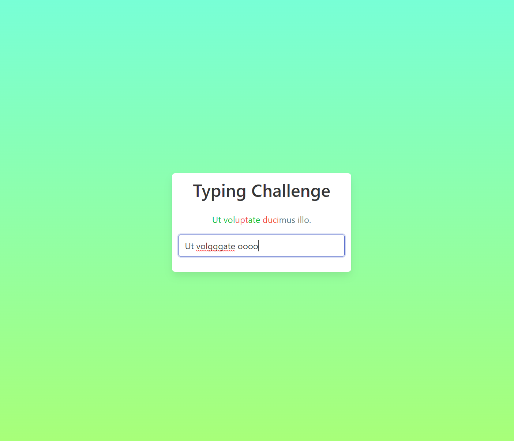
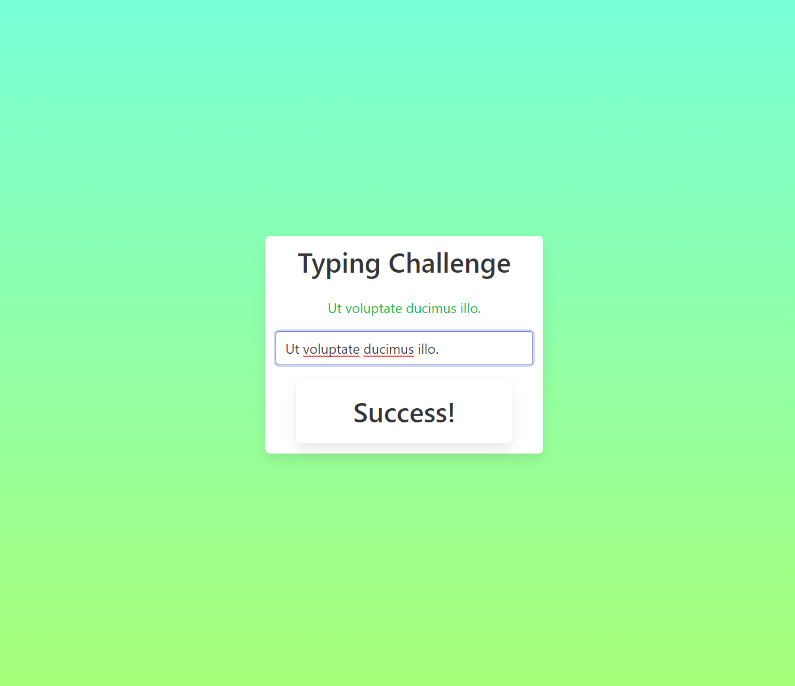

<h1 align="center">Typing</h1>

   Project created for practice and improving knowledge of Angular and TypeScript.

  <h3>
    <a href="#">
      Demo
    </a>
  </h3>

## Table of Contents

- [Overview](#overview)
  - [Built With](#built-with)
- [Features](#features)
- [Acknowledgements](#acknowledgements)
- [Contact](#contact)

## Overview

With this project I've learned/improved:

- Handling User Input
- Conditional Display
- Character by Character Comparison
- Property Binding

### Built With

- This project was generated with [Angular CLI](https://github.com/angular/angular-cli) version 16.1.1.
- Deploy with [Vercel CLI](https://vercel.com) version 30.2.3.
- [Bulma](https://bulma.io/): the modern CSS framework.
- [Faker library](https://www.npmjs.com/package/faker/v/5.5.3) version faker@5.5.3 - randomly generate a sentence.

## Features

- Randomly Generate a sentence.
- Display each character, but color it:
  - green: it's right;
  - red: it's wrong;
  - grey: a given character hasn't been entered yet;
- If the user enters the correct text, show the 'Success!' message.

## Acknowledgements

- [The Modern Angular Bootcamp](https://www.udemy.com/share/102vm43@kPKjsEC86Z2cm1N7cEMAmpq9YQoyx7o7SNnGaYvWULiDXHnFRZr64mMgoyrYOv78/)

## Contact

- Website [cv-webpage](https://ievgeniiaabdulina.github.io/rsschool-cv/)
- Portfolio [Personal-Portfolio-Webpage](https://ievgeniiaabdulina.github.io/Personal-Portfolio-Webpage/)
- GitHub [@IevgeniiaAbdulina](https://github.com/IevgeniiaAbdulina)

 
Date: 6/2023
